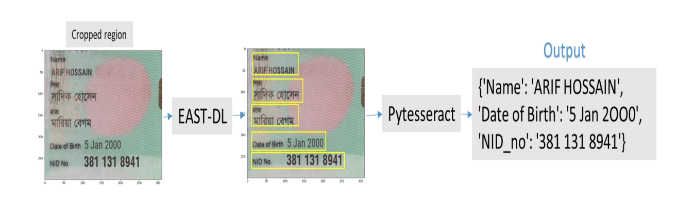
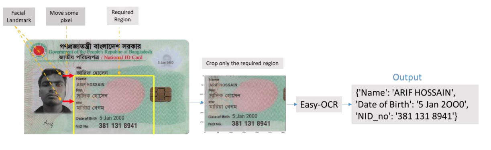
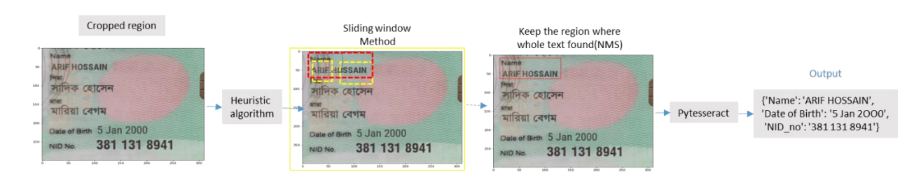

# Project-NID

Text detection from image is a very challenging task due to lighting conditions, image quality,  and non-planar objects etc. Here are some difficulties that have faced

+ #### Viewing angles: 
    + 1st I have faced a Viewing angle problem where text can naturally have  viewing angles that are not parallel to the text. So it makes the text harder to recognize. 

+ #### Blurring:
    + Some images looks blur problem. This also create problem in OCR based project. 

+ #### Lighting conditions: 
    + The saturation effect of the the entire was not same. So this lighting  condition also created problem.  

+ #### Non-paper objects:
    + It causes main problem in my work. The image contains many Non-paper  objects such as watermark, logos, signs, etc. and these causes reflective problem. some letter  has overlapped with this reflective. 

`N.B: When I was testing my model with not reflective image that time my model works very  well. `

### To solve these problem I have applied different method.  
+ Easy-OCR 
+ Tesseract
+ EAST - Deep Learning based method
+ Heuristic Algorithm

Before applying these methods I have applied different pre-processing methods that have been  shown in code implementation. For changing the viewing angle using object detection  algorithms. For this reason 1st I have detected the NID card region, crop this region. I have also  applied the OpenCV contour detection algorithm that did not give any advantage. So I have used an object detection algorithm. 

   
  <!-- <i>An example of Apps output.</i> -->

## `Tesseract:`  
Tesseract is an open source text recognition (OCR) Engine. It uses LSTM to extract text from  any image. 
(1)Doesn't do well with images affected by artefacts including partial occlusion, distorted  perspective, and complex background. 
(2)Poor quality scans may produce poor quality OCR. 

## `EAST - Deep Learning based method:`  
First I have detect the facial landmark using facial recognition. With respect to this facial  landmark I have cropped only the necessary region that means name, age and NID no. region and all other part of the image is suppressed. Then I have applied EAST deep learning based  for recognizing the requirement text. EAST(Efficient and Accurate Scene Text) text detector  is a deep learning model, based on a novel architecture and training pattern.  
It is capable of  
+ (1) running at near real-time at 13 FPS on 720p images and  
+ (2) obtains state-of-the-art text detection accuracy.

In the same process I have used for Easy-OCR implementation. Easy-OCR has the  ability to convert files into searchable text, which allows for individuals to locate words easily.

   
  <i>An example of EAST.</i>

## `Easy-OCR: `  
First I have detect the facial landmark using facial recognition. With respect to this facial  landmark I have cropped only the necessary region that means name, age and NID no. region  and all other part of the image is suppressed. Then I applied this crop image to Easy-OCR  algorithm that gives me following output. 

   
  <i>An example of Easy-OCR.</i>

## `Heuristic Algorithm:  `  
There is another object detection method I have implemented where I have first detected the  location of name, age and NID no region using the Sliding window method. Then I have applied  Non Max Suppression(NMS) to crop only the required region where whole text was found.  Once I have the ROI of the text area I could pass it into an algorithm that is dedicated to  performing Optical Character Recognition (OCR) which give good accuracy. 

   
  <i>An example of Heuristic Algorithm.</i>

## Author
+ Name: Jahid Hasan
+ 𝐏𝐡𝐨𝐧𝐞:   (+880) 1772905097 (Whatsapp)
+ 𝘔𝘢𝘪𝘭:     jahidnoyon36@gmail.com
+ LinkedIn: http://linkedin.com/in/hellojahid
